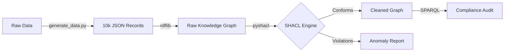
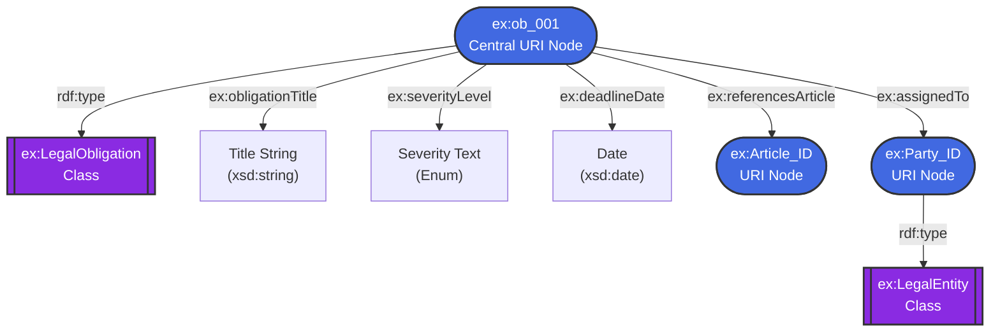

# Legal-KG-Validator

An automated pipeline for generating legal Knowledge Graphs (RDF), using SHACL constraints to detect LLM hallucinations, and querying the validated data with SPARQL.

*Developed as a proof-of-concept for the **PhD Position in Knowledge Graphs (Ref: BAP-2026-548)** at KU Leuven (DTAI / EAVISE / Flanders Make) under Prof. Anastasia Dimou.*

---

## 📖 Project Overview

While Large Language Models (LLMs) are highly capable of extracting compliance requirements from unstructured legal text, they frequently suffer from hallucinations (e.g., generating invalid dates, missing critical entity assignments, or hallucinating severity levels). 

This project builds a declarative Semantic Web "firewall" to catch those errors. It demonstrates how to integrate AI data extraction with strict, graph-based data engineering protocols.

### Core Capabilities
* **Synthetic Data Generation:** Programmatically generates a 10,000-record compliance dataset with intentionally injected anomalies (simulating LLM extraction failures).
* **RDF Transformation:** Maps tabular JSON data into semantic triples using `rdflib` and a custom ontology, handling bad AI datatypes defensively.
* **SHACL Validation:** Applies W3C SHACL shape constraints via `pyshacl` to enforce data types, cardinalities, and valid object references across the graph.
* **SPARQL Analytics:** Queries the validated graph to extract high-priority compliance insights.

---

## 🏗️ Architecture & Data Model

### The Pipeline


### The Graph Ontology

For every legal obligation extracted, the Python script builds the following semantic structure. SHACL constraints ensure that `ex:assignedTo` points to a valid URI node and `ex:deadlineDate` strictly follows `xsd:date` formatting.



---

## 📂 Repository Structure

```text
legal-kg-validator/
│
├── generate_data.py        # Generates synthetic LLM extraction data with anomalies
├── pipeline.py             # Main ETL, RDF mapping, and SHACL validation script
├── shapes.ttl              # SHACL constraints ontology
├── queries/
│   └── compliance_audit.rq # SPARQL query file
├── requirements.txt        # Python dependencies
├── .gitignore
└── README.md

```

---

## 🚀 Quick Start

### 1. Installation

Clone the repository and install the dependencies (Python 3.9+ recommended).

```bash
git clone [https://github.com/YOUR_GITHUB_USERNAME/legal-kg-validator.git](https://github.com/YOUR_GITHUB_USERNAME/legal-kg-validator.git)
cd legal-kg-validator
python -m venv .venv

# Windows
.venv\Scripts\activate
# Mac/Linux
source .venv/bin/activate

pip install -r requirements.txt

```

### 2. Generate the Dataset

Run the data generator to create a synthetic dataset of 10,000 records. ~5% of these records will contain intentional errors (bad dates, missing parties, invalid enums).

```bash
python generate_data.py

```

*Output: Creates `large_extracted_data.json`.*

### 3. Run the Knowledge Graph Pipeline

Execute the main pipeline to build the RDF graph, validate it with SHACL, and query it.

```bash
python pipeline.py

```

---

## 📊 Expected Output

When running `pipeline.py`, you will see the system gracefully handle the intentional data anomalies. `rdflib` scales efficiently, generating ~60,000 triples in under 2 seconds, while the SHACL engine catches every injected error.

```text
--- Loading Large Scale Dataset ---
Generated 59913 RDF triples in 1.45 seconds.

--- Running SHACL Validation Engine ---
Validation took 4.12 seconds.
Graph Conforms: False
Total Anomalies Caught by SHACL: 504

--- Executing SPARQL Queries ---
SPARQL Execution Time: 0.12 seconds.
Found 2450 HIGH/CRITICAL obligations.

```

---

## 👤 Author

**[Your Name]**

*AI Engineer & Knowledge Graph Candidate*

* [Your LinkedIn]
* [Your Email]

```

***Note:** Make sure to replace `YOUR_GITHUB_USERNAME`, `[Your Name]`, `[Your LinkedIn]`, and `[Your Email]` at the top and bottom of the file before you commit it!*

```